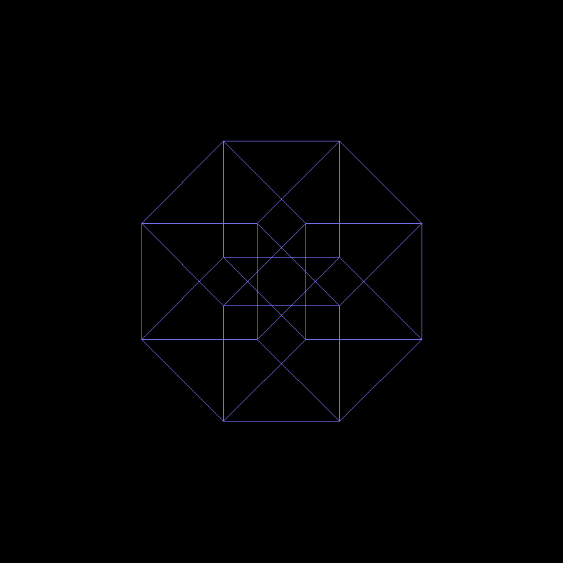

# Hypercube rotation cg project

</img>

## Requirements

* python 3.9
* numpy
* matplotlib

or simply use:

    pip3 install -r requirements.txt

## Run

For static image

    python3 main.py

For dynamic animation

    python3 anim.py

