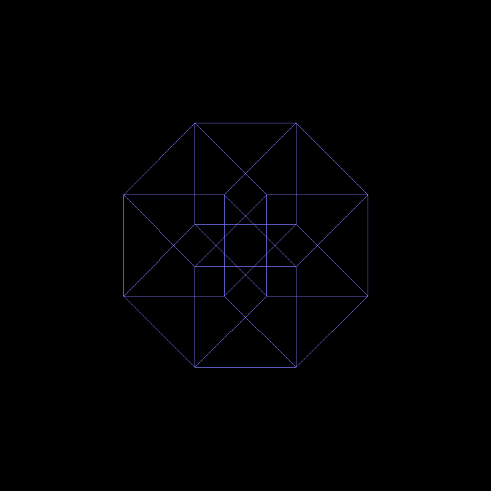
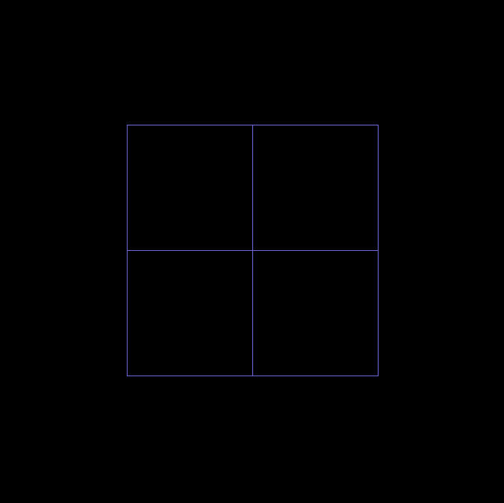
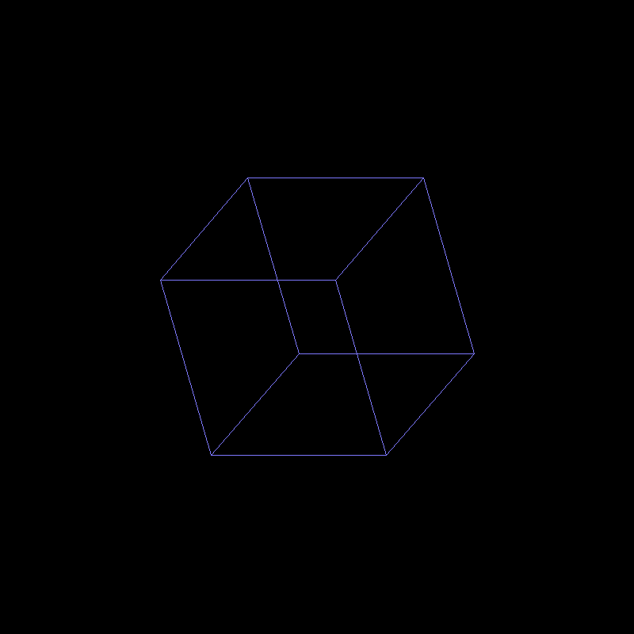
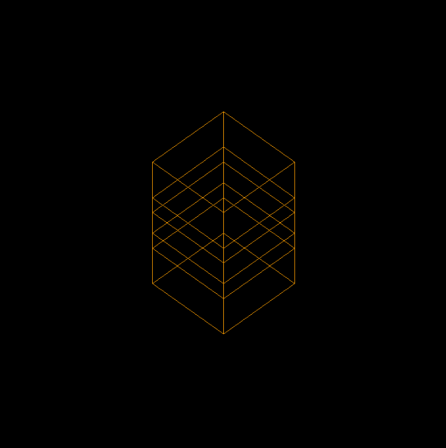
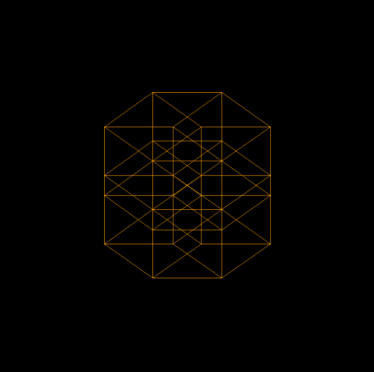
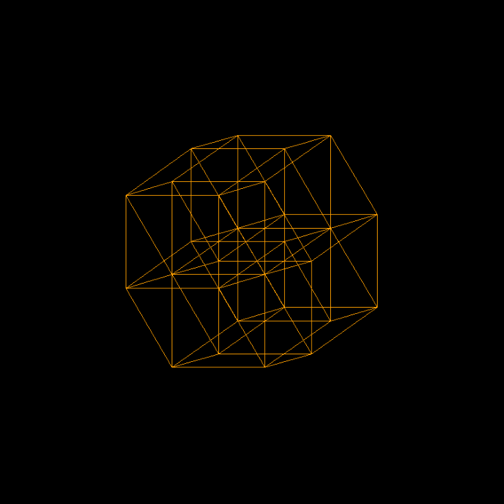

# Hypercube rotation cg project

</img>

## Requirements

* python 3.9
* numpy
* matplotlib

or simply use:

    pip3 install -r requirements.txt

## Run

### 4D hypercube

For static image

    python3 main_4d.py

For dynamic animation

    python3 anim_4d.py

for 5d hypercube run main_5d.py or anim_5d.py

## Examples

### 4D

</img>
</img>
</img>

---

### 5D
</img>
</img>
</img> 